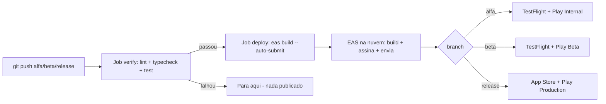

# Deploy Automatizado — Setup (Fase 5)

Guia de **configuração única** (one-time) para que o deploy nas lojas rode 100% automatizado: `git push` em `alfa` / `beta` / `release` → build na nuvem do EAS → submissão à loja, **sem intervenção manual**.

Depois deste setup, o ciclo recorrente é só `git push`. Detalhes e fontes em [plano-de-acao-fase-5.md](file:///Users/titorm/git/agenda-de-boteco/docs/plano-de-acao-fase-5.md).

---

## Como o pipeline funciona



| Branch | Perfil de build | `environment` (Supabase) | Submit (iOS) | Submit (Android) |
| :--- | :--- | :--- | :--- | :--- |
| `alfa` | `alfa` (`extends: production`) | `development` | TestFlight | track `internal` |
| `beta` | `beta` (`extends: production`) | `preview` | TestFlight | track `beta` |
| `release` | `production` | `production` | App Store | track `production` |

O job `deploy` só roda se o job `verify` (lint + typecheck + test na raiz) passar — build quebrado **não** chega às lojas. O build usa `--no-wait`: o runner dispara e o EAS continua na nuvem (não consome minutos do GitHub esperando).

---

## ✅ Checklist de setup único (na ordem)

### 1. Provisionar no EAS (uma vez, interativo, `cwd = apps/mobile`)

```bash
pnpm dlx eas-cli@latest login
pnpm dlx eas-cli@latest init        # cria o projeto; anote o projectId retornado (vira a var EAS_PROJECT_ID)
pnpm dlx eas-cli@latest credentials # interativo — configure TUDO abaixo:
```

No menu de `eas credentials`, deixe **tudo gerenciado pelo EAS** (nada de segredo no git):

- [ ] **iOS → Build Credentials:** gerar Distribution Certificate + Provisioning Profile (login Apple 1x).
- [ ] **iOS → App Store Connect API Key:** criar/enviar a API Key (`.p8`) — fica nos servidores EAS, dispensa `ascApiKeyPath` no `eas.json`.
- [ ] **Android → Keystore:** gerar (upload key). **Backup obrigatório.** Nunca regerar após publicar.
- [ ] **Android → Google Service Account Key:** *Add a Google Service Account Key → Upload new key* (o JSON gerado no Google Cloud). Fica no EAS, dispensa `serviceAccountKeyPath`.

### 2. Criar variáveis de ambiente do app no EAS (uma vez por environment)

```bash
# cwd = apps/mobile — repita para --environment development | preview | production
eas env:create --environment production --name EXPO_PUBLIC_SUPABASE_URL    --value "https://<prod>.supabase.co"             --visibility plaintext
eas env:create --environment production --name EXPO_PUBLIC_SUPABASE_KEY    --value "<anon-key-prod>"                        --visibility sensitive
eas env:create --environment production --name GOOGLE_MAPS_API_KEY_IOS     --value "<key-ios-prod>"                         --visibility sensitive
eas env:create --environment production --name GOOGLE_MAPS_API_KEY_ANDROID --value "<key-android-prod>"                     --visibility sensitive
eas env:create --environment production --name EXPO_PUBLIC_SHARE_BASE_URL  --value "https://agenda-do-boteco.inovacode.dev" --visibility plaintext
```

- [ ] `development` preenchido (Supabase dev) — usado pelo canal `alfa`.
- [ ] `preview` preenchido (Supabase staging) — usado pelo canal `beta`.
- [ ] `production` preenchido (Supabase prod) — usado pelo canal `release`.
- [ ] Conferir: `eas env:list --environment <env>`.

### 3. Registrar os apps nas lojas + 1º upload manual (obrigatório uma vez)

- [ ] **App Store Connect:** criar o app (Bundle ID `com.agenda.boteco`, idioma PT-BR, nome ≤ 30 chars). Anotar o **Apple ID** do app (ASC → App Information → General → Apple ID) → vira a var `ASC_APP_ID`.
- [ ] **Google Play Console:** criar o app + **fazer o 1º upload manual do AAB** (limitação da API do Google — sem isso o `eas submit` falha no primeiro envio). O `eas build --auto-submit` automatiza só a partir do 2º.

### 4. Configurar o GitHub (Settings do repositório)

**Settings → Secrets and variables → Actions:**

- [ ] **Secret** `EXPO_TOKEN` — Access Token gerado em expo.dev → Account Settings → Access Tokens. *(único segredo necessário)*
- [ ] **Variable** `EAS_PROJECT_ID` — o `projectId` do passo 1 (não é segredo; é o `extra.eas.projectId` que o build lê via `process.env`).
- [ ] **Variable** `ASC_APP_ID` — o Apple ID do app do passo 3 (resolve o `$ASC_APP_ID` do `eas.json`; só usado no submit iOS).

> `EAS_PROJECT_ID` e `ASC_APP_ID` são **Variables** (não Secrets) — são identificadores públicos, não credenciais.

### 5. Validar uma vez antes de confiar no automático

- [ ] `git push` em `alfa` → conferir no GitHub Actions que `verify` passa e `deploy` dispara.
- [ ] Conferir no dashboard expo.dev que o build conclui e o auto-submit entrega no TestFlight + Play Internal.

---

## Pré-requisitos que o `--non-interactive` exige (resumo)

O `eas build --non-interactive` falha se faltar **qualquer** prompt habitual. Tudo abaixo precisa existir **antes** do primeiro deploy automatizado:

| Pré-requisito | Onde | Sem ele |
| :--- | :--- | :--- |
| `extra.eas.projectId` resolvível | `EAS_PROJECT_ID` (GitHub var) → `app.config.ts` | build não linka o projeto |
| `usesNonExemptEncryption: false` | `app.config.ts` (já configurado) | iOS trava em "Missing Compliance", não chega ao TestFlight |
| Cert + Provisioning iOS | EAS Servers (`eas credentials`) | build iOS pede login interativo |
| Keystore Android | EAS Servers (`eas credentials`) | build Android pede prompt |
| ASC API Key (`.p8`) | EAS Servers (`eas credentials`) | submit iOS não autentica |
| Service Account JSON | EAS Servers (`eas credentials`) | submit Android não autentica |
| `ascAppId` | `ASC_APP_ID` (GitHub var) → `$ASC_APP_ID` no `eas.json` | submit iOS pede o app interativamente |
| Env vars do app | EAS Environment Variables | build sem Supabase/Maps → app vazio na revisão |
| 1º upload manual AAB | Play Console | primeiro `eas submit` Android falha |

---

## ⚠️ Limite real da automação total (Google Play)

Se a conta Play for **pessoal criada após 13/11/2023**, o track `production` **não libera** sem um **Closed testing com ≥ 12 testers por 14 dias consecutivos** antes. O pipeline automatiza o build+submit, mas esse requisito de elegibilidade é **manual/temporal** e precisa ser cumprido antes de `release` publicar de fato em produção. Contas de organização e anteriores a 13/11/2023 estão isentas. Ver [plano-de-acao-fase-5.md](file:///Users/titorm/git/agenda-de-boteco/docs/plano-de-acao-fase-5.md) (T5.3.3).
