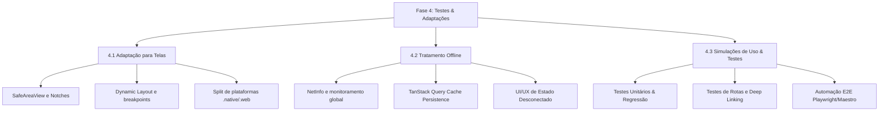

# Plano de Ação - Fase 4: Testes de Qualidade e Adaptações

Este documento apresenta o plano de ação detalhado para a implementação da **Fase 4 (Testes de Qualidade e Adaptações)** do projeto **Agenda de Boteco**, estimada em **30 horas** de esforço no orçamento comercial.

O objetivo desta fase é assegurar a robustez visual, a estabilidade offline e a integridade de fluxos de navegação e lógica de dados do ecossistema, abrangendo o aplicativo móvel (`apps/mobile` em Expo v56) e suas interações com as camadas compartilhadas (`packages/core`).

---

## 📌 Contexto e Diretrizes Gerais

Toda a execução deste plano de ação deve respeitar rigorosamente as premissas arquiteturais do projeto:

- **Monorepo:** Uso do `pnpm` e Turborepo. Comandos devem ser disparados via `turbo` no diretório raiz.
- **Expo v56:** Respeitar as diretrizes de ciclo de vida e APIs nativas descritas na documentação oficial do Expo v56.
- **Segurança e Regressão de Código:** Qualquer alteração em serviços ou utilitários requer a criação/atualização de testes unitários que garantam **proteção estrita contra regressão comportamental** (garantir contratos de tipo e valor de entrada/saída).
- **Sem Comentários no Código:** Nenhum comentário de desenvolvimento deve ser adicionado no código-fonte dos novos arquivos, exceto se solicitado explicitamente pelo usuário.
- **Tipagem Estrita:** Proibido o uso do tipo `any` em qualquer declaração de código TypeScript de apoio/exemplo.

---

## 🛠️ Detalhamento das Atividades

### 1. Tarefa 4.1: Adaptação para Telas (Esforço: 12 horas)

**Objetivo:** Ajustar milimetricamente o design para celulares modernos (com notch/dynamic island), aparelhos antigos e a versão Web.

#### Plano de Ação (4.1)

1. **Configuração de SafeArea Global e Contextual:**
   - Validar se todos os fluxos de navegação utilizam `SafeAreaProvider` do `react-native-safe-area-context` na raiz do `apps/mobile`.
   - Substituir ou complementar contêineres padrões com `useSafeAreaInsets` para posicionamento fino de cabeçalhos fixados e barras de navegação flutuantes, impedindo sobreposição por barras de status, notches ou indicadores de navegação de sistema.
2. **Visual Responsivo Customizado (Nativewind + Hooks):**
   - Garantir que não existam prefixos de breakpoint do Nativewind (`sm:`, `md:`, `lg:`) sendo usados diretamente para layouts nativos (visto que estes se aplicam exclusivamente ao web target).
   - Implementar regras de layout baseadas em hooks como `useWindowDimensions` ou hooks customizados de tamanho de viewport para determinar flexibilidade de grades e fontes em aparelhos pequenos (ex: iPhone SE) ou grandes (tablets e dobráveis).
3. **Isolamento de Código por Plataforma:**
   - Para elementos visuais complexos que divirjam estruturalmente entre Web e Mobile (ex: menus complexos, componentes de mapas nativos versus web), empregar arquivos com sufixos específicos (`.native.tsx` e `.web.tsx`).
4. **Homologação Multidispositivos:**
   - Executar bateria de verificação visual nos seguintes ambientes:
     - **iOS Simulators:** iPhone 15/16 Pro (Notch/Dynamic Island), iPhone SE 3rd Gen (Aspect Ratio 16:9), iPad.
     - **Android Emulators:** Pixel 8/9, dispositivos com resoluções mais baixas (ex: Nexus S).
     - **Web target:** Responsividade simulada no navegador desktop (Chrome/Safari DevTools) de 320px a 1440px.

---

### 2. Tarefa 4.2: Tratamento Offline (Esforço: 6 horas)

**Objetivo:** Implementar fluxos e feedbacks amigáveis que evitem travamentos ou telas em branco quando a conexão com o Supabase for interrompida.

#### Plano de Ação (4.2)

1. **Detecção e Monitoramento de Conexão:**
   - Implementar hook customizado que abstraia o estado de conectividade:
     - **Nativo:** Utilizar `@react-native-community/netinfo`.
     - **Web:** Utilizar `navigator.onLine` acoplado a listeners de evento `online`/`offline`.
2. **Persistência de Dados e Cache (TanStack Query):**
   - Configurar persistência local do cliente do TanStack Query usando `@react-native-async-storage/async-storage` com `@tanstack/query-async-storage-persister` no `apps/mobile`.
   - Definir regras de expiração do cache e stale times conservadores para dados críticos, garantindo que o usuário possa consultar os destaques locais e a lista de favoritos salvos mesmo sem internet.
3. **Interface de Usuário em Modo Offline:**
   - Criar componente de alerta de conectividade global (Barra/Toast discreto com micro-animação via `react-native-reanimated`).
   - Criar estados visuais vazios (Empty States) contendo explicações amigáveis: *"Você está sem internet no momento. Exibindo informações salvas offline."*
   - Incluir botão de "Tentar Novamente" que force o trigger de `refetch()` nas queries do TanStack Query.
4. **Resiliência de Ações Críticas (Ex: Favoritar):**
   - Implementar atualizações otimistas (optimistic updates) no TanStack Query ao favoritar bares ou eventos.
   - Guardar ações de favoritos offline no AsyncStorage local e sincronizar com o Supabase assim que a conexão for restabelecida.
   - Envolver camadas críticas com React Error Boundaries para evitar falhas completas da aplicação.

---

### 3. Tarefa 4.3: Simulações de Uso e Testes (Esforço: 12 horas)

**Objetivo:** Testar caminhos críticos de navegação e regras de negócio de ponta a ponta para eliminar gargalos ou comportamentos inesperados.

#### Plano de Ação (4.3)

1. **Blindagem Lógica e Testes de Regressão (Serviços e Utils):**
   - Mapear todos os métodos e hooks utilitários em `packages/core` e `apps/mobile` modificados ou adicionados.
   - Criar testes unitários obrigatórios via **Jest** para validar o contrato estrito de entrada e saída dessas funções.
2. **Testes de Integração e Validação de Rotas:**
   - Testar o fluxo de roteamento do **Expo Router** no `apps/mobile`. Garantir que deep links estruturados (`/eventos/{cidade}/{slug}`) resolvam e passem os parâmetros corretos para a tela final, aplicando a validação em runtime por esquemas do **Zod**.
   - Validar que a busca por proximidade via PostGIS através de chamadas RPC no Supabase tenha testes unitários/mocks com coordenadas de teste válidas e inválidas.
3. **E2E e Simulação Automatizada:**
   - **Plataforma Web (apps/admin e mobile web):** Estruturar testes de regressão visual e fluxo ponta a ponta via Playwright ou Cypress.
   - **Aplicativo Móvel (iOS/Android):** Configurar testes automatizados básicos de interface (ex: usando Maestro ou Detox) para reproduzir o ciclo do usuário:
     1. Abrir app.
     2. Visualizar Feed principal.
     3. Filtrar eventos por dia/bairro.
     4. Acessar detalhes de um bar específico.
     5. Alternar status de rede para offline e confirmar persistência do conteúdo em cache.
4. **Casos de Teste Manuais Críticos (Manual QA checklist):**
   - Fluxo de interrupção de rede: Abrir tela de detalhes, cortar conexão no meio do carregamento de imagens, testar comportamento dos placeholders.
   - Teste de concorrência: Atualizar dados do bar na plataforma administrativa (`apps/admin`) e checar se o listener do app atualiza a UI nativa imediatamente sem vazamento de memória ou travamentos.

---

## 📈 Cronograma e Esforço Estimado

A Fase 4 será desenvolvida ao longo de um ciclo iterativo, estruturado nas 30 horas previstas:

| ID | Atividade | Esforço | Entregáveis Principais |
| :--- | :--- | :---: | :--- |
| **T4.1** | Adaptação para Telas | 12h | Telas adaptadas para notch/SafeAreas; layouts responsivos no mobile; testes de viewports. |
| **T4.2** | Tratamento Offline | 6h | Sincronizador de rede; persistência de cache offline; telas de aviso e banners de fallback. |
| **T4.3** | Simulações de Uso e Testes | 12h | Cobertura de testes Jest para rotas/utils; testes automatizados de navegação; checklist de QA manual. |
| **Total** | | **30h** | **Homologação e Estabilização Geral da Fase 4** |

---

## 🏁 Definição de Concluído (Definition of Done - DoD)

Uma tarefa da Fase 4 só será considerada finalizada se atender a todos os critérios abaixo:

1. **Compilação:** O código compila sem erros de TypeScript (modo `strict`) nas áreas afetadas.
2. **Cobertura Visual:** O layout está perfeitamente centralizado e legível em telas pequenas e com notch, sem overflow de texto.
3. **Simulação Offline:** O comportamento offline foi validado tanto em ambiente simulado de navegador (desconexão de rede local) quanto no emulador móvel.
4. **Sem Regressão:** Todos os testes unitários novos e existentes foram executados via `turbo run test` e passaram com sucesso.
5. **Aprovação de Lint:** Execução sem avisos do comando `pnpm lint` na raiz do monorepo.
