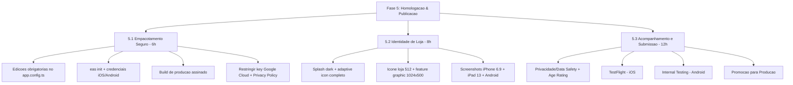

# Plano de Ação — Fase 5: Homologação e Publicação nas Lojas

Este documento descreve, passo a passo, a execução da **Fase 5 (Homologação e Publicação nas Lojas)** do projeto **Agenda de Boteco**, estimada em **26 horas** no orçamento comercial.

O objetivo desta fase é levar o app de `apps/mobile` (Expo SDK 56) à **App Store (iOS)** e ao **Google Play (Android)** com **zero idas-e-vindas de revisão** — toda decisão técnica abaixo foi auditada contra a documentação oficial do Expo SDK 56 e contra as políticas vigentes da Apple e do Google (2025/2026).

> **Executor-alvo:** dev sênior. Os passos assumem familiaridade com terminal, Xcode/consoles e EAS.
> **Contas:** Apple Developer Program e Google Play Console já ativas e verificadas.
> **Canal inicial:** teste interno (TestFlight + Internal Testing) → **promover** para produção depois de validado.

---

## 📌 Estado real do projeto (verificado neste repositório)

Antes de qualquer comando, estes fatos do código foram conferidos — eles ditam o runbook:

| Item | Estado verificado | Implicação |
| :--- | :--- | :--- |
| Fluxo nativo | **CNG puro**: nem `apps/mobile/ios/` nem `apps/mobile/android/` estão no git (`android/` está em `.gitignore:166`). | O EAS roda `prebuild` na nuvem. **Toda** config nativa vai pelo `app.config.ts` — nunca editar `Info.plist`/`AndroidManifest.xml` à mão (são descartáveis). |
| `app.config.ts` | `version: '1.0.0'`; `bundleIdentifier`/`package` = `com.agenda.boteco`; **sem** `extra.eas.projectId`; **sem** `ios.config.usesNonExemptEncryption`; **sem** `android.adaptiveIcon.monochromeImage`. | Há 3 edições obrigatórias no config antes do primeiro build (Tarefa 5.1). |
| `eas.json` | `cli.appVersionSource: 'remote'`; perfis de **build** = `development`/`preview`/`production` (production com `autoIncrement`); perfis de **submit** = `alfa`/`beta`/`production`. Todos os `submit.*.ios` estão `{}`. | `eas build --profile alfa` **falha** (`alfa` não é perfil de build). O versionCode/buildNumber é gerido pelo EAS no servidor — começa em **1**. |
| Permissão de localização | `expo-location` com `locationWhenInUsePermission` (foreground apenas; **sem** `ACCESS_BACKGROUND_LOCATION`). | Não dispara formulário de background nem vídeo-demo no Google. Reduz a superfície de revisão. |
| Google Maps API key | Injetada via `process.env.GOOGLE_MAPS_API_KEY_*`. **Não há segredo no git** (`git grep AIzaSy` = vazio; só aparece no manifest gerado, que é ignorado). | Sem vazamento. A pendência é **restringir** a key no Google Cloud (Tarefa 5.1.4), não removê-la do git. |
| Privacy Policy | **Inexistente** em todo o código. | **Bloqueador absoluto** das duas lojas. É a primeira coisa a resolver (Tarefa 5.1.5). |
| `packages/core` | `main`/`types` apontam para `src/index.ts`; `build` é `echo` (source-only, `outputs: []` no turbo). | **Não** adicionar `postinstall` de build — o Metro transpila o workspace direto. |

---

## 🛠️ Visão geral das atividades



> **A ordem importa.** As três tarefas têm dependências: a 5.1 produz o binário, a 5.2 produz os materiais visuais que a 5.3 sobe, e a 5.3 só fecha se 5.1 (export compliance, privacy policy) estiver feita. Execute na sequência.

---

## 1. Tarefa 5.1 — Empacotamento Seguro (Esforço: 6 horas)

**Objetivo:** gerar o binário final assinado, sem armadilhas que travem a entrega (export compliance, privacy policy, credenciais).

### 5.1.1 — Três edições obrigatórias no `app.config.ts`

Estas edições eliminam três causas conhecidas de "vai e vem". Faça **antes** do primeiro build.

1. **Export Compliance (iOS) — sem isso o build trava em "Missing Compliance" e não chega ao TestFlight sozinho.**
   ```ts
   ios: {
     supportsTablet: true,
     bundleIdentifier: 'com.agenda.boteco',
     config: {
       usesNonExemptEncryption: false, // app usa só HTTPS/cripto do SO (Supabase, Maps)
       googleMapsApiKey: process.env.GOOGLE_MAPS_API_KEY_IOS,
     },
   },
   ```
   > `false` é uma **declaração legal vinculante** (lei de exportação dos EUA). É legítimo aqui porque não há criptografia proprietária — apenas HTTPS via `@supabase/supabase-js` e Google Maps.

2. **`projectId` do EAS** — gravado por `eas init` (passo 5.1.2). Como **não existe `app.json`**, o `projectId` precisa ser persistido **à mão** no `return` do `app.config.ts`:
   ```ts
   extra: {
     eas: { projectId: '<uuid-retornado-pelo-eas-init>' },
   },
   ```

3. **Adaptive icon completo (Android)** — referenciar os assets de tema que já existem mas não estão ligados (detalhe na Tarefa 5.2.1).

### 5.1.2 — Vincular o projeto ao EAS e autenticar

> **Monorepo:** todos os comandos EAS rodam com `cwd` em `apps/mobile` (onde vive o `eas.json`). Rodar da raiz não encontra o arquivo. O `.npmrc` da raiz já tem `node-linker=hoisted` (necessário para o EAS resolver módulos nativos) — não mexer.

```bash
# cwd = /Users/titorm/git/agenda-de-boteco/apps/mobile
pnpm dlx eas-cli@latest login
pnpm dlx eas-cli@latest whoami
pnpm dlx eas-cli@latest init     # cria o projeto e retorna o projectId -> colar no app.config.ts (5.1.1.2)
```

### 5.1.3 — Credenciais de assinatura (gerenciadas pelo EAS)

Rode **uma vez, interativamente** (popula as credenciais no servidor EAS; depois o CI usa `--non-interactive`):

```bash
pnpm dlx eas-cli@latest credentials   # interativo: selecione a plataforma
# iOS:     gera Distribution Certificate + Provisioning Profile (login Apple 1x).
#          Para CI, prefira App Store Connect API Key (.p8) a Apple ID + senha.
# Android: gera o keystore (upload key do Play App Signing).
```

> ⚠️ **Nunca regenerar o keystore Android após publicar** — o Google rejeita assinatura diferente. Faça **backup** do keystore. O Google guarda a *signing key* (Play App Signing); o EAS guarda a *upload key*.

### 5.1.4 — Restringir a Google Maps API key (segurança, não rejeição)

No **Google Cloud Console**, restrinja a key Android por **package name + SHA-1** do certificado de assinatura e limite às APIs usadas (Maps SDK for Android/iOS). Faça o mesmo para a key iOS por bundle ID. Isso evita abuso/cobrança da key que vai embutida no app.

### 5.1.5 — Privacy Policy pública (BLOQUEADOR — resolver primeiro)

As duas lojas **exigem** uma URL de política de privacidade HTTPS ativa, e ela deve cobrir **as mesmas categorias** declaradas no App Privacy (Apple) e no Data Safety (Google):

- **Localização precisa** coletada para funcionalidade (descoberta por proximidade);
- **Google Maps SDK** e **Supabase** como **processadores/destinatários** de dados.

> O app já tem target web (`web.output: 'static'`). Aproveite: publique a política numa rota pública do próprio build web (ex.: `/privacidade`) e use essa URL nos dois consoles.

### 5.1.6 — Build de produção assinado

```bash
# cwd = apps/mobile
eas build --platform all --profile production
# iOS  -> .ipa (runner usa imagem com SDK iOS recente; cumpre o mandato Apple automaticamente)
# Android -> .aab assinado (default do EAS; novos apps SÓ aceitam AAB, nunca APK)
```

- **Versionamento:** com `appVersionSource: 'remote'` + `autoIncrement` (perfil production), o EAS gera `buildNumber`/`versionCode` no servidor — este é o **primeiro build**, então a versão remota inicializa em **1** (não há `versionCode`/`buildNumber` no config). O `version: '1.0.0'` visível é **manual** e o `autoIncrement` nunca o altera.
- **Pré-requisito de dados:** garanta que o build de produção aponte para o **Supabase de produção** (não dev/staging) e que a RLS permita **leitura pública** de eventos `published` — senão o app aparece vazio na revisão (rejeição Apple 2.1 / Google "minimum functionality").

---

## 2. Tarefa 5.2 — Identidade de Loja (Esforço: 8 horas)

**Objetivo:** produzir todos os materiais visuais obrigatórios. **Atenção:** o EAS gera apenas os ícones embutidos no binário a partir do master 1024×1024. Os assets de **listagem de loja** (ícone 512, feature graphic, screenshots) são enviados **manualmente** no console — `eas submit` **não** os sobe.

### 5.2.1 — Ajustes de identidade no app (binário)

1. **Splash dark explícito** — preferir `splash-icon.png` (1024×1024 com alfa, já existe) em vez de `logo.png` (sem alfa). Definir bloco `dark` para garantir `#0F0F0F`:
   ```ts
   ['expo-splash-screen', {
     backgroundColor: '#0F0F0F',
     image: './assets/splash-icon.png',
     imageWidth: 200,
     resizeMode: 'contain',
     dark: { backgroundColor: '#0F0F0F', image: './assets/splash-icon.png' },
   }],
   ```
2. **Adaptive icon Android completo** — os assets `android-icon-background.png` e `android-icon-monochrome.png` existem mas não estão referenciados:
   ```ts
   adaptiveIcon: {
     foregroundImage: './assets/android-icon-foreground.png',
     backgroundColor: '#0F0F0F',
     monochromeImage: './assets/android-icon-monochrome.png', // themed icons Android 13+
   },
   ```
   > **Atenção ao foreground:** o `android-icon-foreground.png` atual (1024×1024) está **sem alfa** (`hasAlpha: no`). O foreground adaptive **precisa** de margem transparente — o logo deve caber no **círculo central de 66 dp** (≈48–66 dp), pois os 18 dp de cada borda são cortados por máscaras dos fabricantes (Pixel squircle, Samsung círculo). Reexporte o foreground **com alfa** e a arte dentro da safe zone, senão há risco de clipping/fundo sólido.

### 5.2.2 — Ícone do app iOS (binário)

- `assets/icon.png`: **1024×1024 PNG, totalmente opaco, sem canal alfa**, quadrado, sem cantos arredondados nem sombra (o sistema mascara). O `icon.png` atual já está correto (`hasAlpha: no`). Valide sempre antes do build:
  ```bash
  sips -g hasAlpha apps/mobile/assets/icon.png   # deve retornar "hasAlpha: no"
  ```
  > **ITMS-90717** ("large app icon can't be transparent / alpha channel") é a rejeição clássica — qualquer alfa residual (borda de 1 px, "Transparency" marcada no editor) derruba o upload.

### 5.2.3 — Assets de listagem (manuais nos consoles)

| Asset | Especificação | Onde |
| :--- | :--- | :--- |
| Ícone de listagem Play | **512×512 PNG 32-bit com alfa**, ≤ 1024 KB, sem cantos/sombra manuais, fundo `#0F0F0F` | Play Console (store listing) |
| Feature graphic Play | **1024×500**, JPEG ou **PNG 24-bit SEM alfa** (obrigatório p/ publicar) | Play Console |
| Screenshots iPhone | **6.9"** (a Apple escala p/ telas menores). Confirmar a dimensão exata no media manager do App Store Connect antes do upload (1320×2868 ou 1260×2736 conforme a tela esperada). PNG/JPEG sRGB, mín. 1 / máx. 10 | App Store Connect |
| Screenshots iPad | **iPad 13" (2064×2752) — OBRIGATÓRIO** porque `supportsTablet: true`. (Para evitar, mudar para `supportsTablet: false`.) | App Store Connect |
| Screenshots Android | mín. **2** p/ publicar; ideal **≥ 4 em ≥ 1080 px** (vitrines). JPEG/PNG 24-bit sem alfa; lado 320–3840 px; maior lado ≤ 2× o menor; 16:9 ou 9:16 | Play Console |

> **Regra de ouro contra 2.3.3 (Apple):** screenshots devem mostrar o **app real em uso** (tema dark), nunca telas de login isoladas, molduras de marketing ou placeholders.

---

## 3. Tarefa 5.3 — Acompanhamento e Submissão (Esforço: 12 horas)

**Objetivo:** preencher todos os formulários de privacidade/conteúdo, submeter para teste interno nas duas lojas e, após validação, promover para produção.

### 5.3.1 — App Store Connect (iOS)

1. **Registrar/criar o app.** Opcional: `eas submit -p ios` **cria o app no ASC automaticamente** se não existir (após login Apple). Ou criar manualmente em ASC > Apps > New App (Bundle ID `com.agenda.boteco`, idioma primário Português-BR, nome ≤ 30 chars).
2. **App Privacy / Nutrition Labels:** declarar **Precise Location** → purpose **App Functionality** → **Not used to track**. Quanto a "Linked to identity": marcar **Yes** se favoritos/dados forem gravados no Supabase sob `auth.uid()` (caso típico aqui); só **No** se a localização for de fato anonimizada antes da coleta.
3. **Age Rating (NOVO sistema, desde 31/01/2026):** o questionário foi expandido e é **obrigatório** — sem ele não dá para submeter. Como é app de **bares**, **declarar honestamente** a referência a álcool (tende a elevar a faixa, provável **16+**). Subdeclarar gera rejeição 2.3 e reassignment automático.
4. **Privacy Policy URL** (a de 5.1.5) em ASC > App Information.
5. **Categoria** coerente: *Food & Drink* ou *Lifestyle*.
6. **Submeter para TestFlight:**
   ```bash
   eas submit -p ios --profile alfa --latest
   ```
   - Build processa no ASC (5–30 min). **Internos** (até 100, com role no ASC) recebem sem review. **Externos** (até 10.000) passam por Beta App Review leve no 1º build (24–48 h).
   - Builds TestFlight **expiram em 90 dias** a partir do upload de cada build.

   > ⚠️ Se `submit.alfa.ios` estiver `{}` (estado atual), o comando **interativo** pergunta `ascAppId`/credenciais. Para CI (`--non-interactive`), preencher `ascAppId` + App Store Connect API Key (`ascApiKeyPath`/`ascApiKeyId`/`ascApiKeyIssuerId`) no `eas.json`.

### 5.3.2 — Google Play Console (Android)

1. **Criar o app** em Play Console > Create app (nome, idioma, tipo, gratuito). O **package** (`com.agenda.boteco`) é travado no **1º upload do AAB** e é imutável — confirmar antes.
2. **1º upload MANUAL do AAB é obrigatório** (limitação da API do Google). Só depois `eas submit` automatiza:
   ```bash
   # depois do 1º upload manual em Internal testing:
   eas submit -p android --profile alfa --latest   # track 'internal'
   ```
3. **Service Account** (para `eas submit`): Google Cloud > Service Accounts > criar + chave JSON → habilitar *Google Play Android Developer API* → Play Console > Users and permissions > convidar o e-mail do SA com permissão de **release no track internal**. Ativação pode levar ~24 h. **Nunca commitar o JSON** (em CI use `eas env:create --type file --visibility secret`, não o legado `eas secret:create`).
4. **Prominent disclosure de localização (in-app):** o Google exige um aviso **dentro do app, antes do prompt do SO**, explicando a coleta e a finalidade, com opção de recusar. **A string do `expo-location` (texto do prompt do SO) NÃO substitui isso.** Esta é uma pendência de implementação se ainda não existir.
5. **App content** (todos obrigatórios para publicar):
   - **Data safety:** declarar **Location > Precise location**, finalidade *App functionality*; revisar se o **Google Maps SDK** recebe/compartilha dados. Deve bater com o manifest e com a Privacy Policy.
   - **Content rating** (IARC): categoria Reference/Social/Lifestyle; **álcool = "sim" apenas se o app focar na VENDA** — descoberta de bares normalmente é "não", mas responder com honestidade e evitar conteúdo que glamurize consumo.
   - **Target audience:** apenas faixas adultas; **não** incluir crianças (dispara Families Policy, incompatível com localização precisa).
   - **Ads:** "No" (sem SDK de anúncios no projeto).
   - **App access:** "All functionality is available without special access" (sem login obrigatório).
   - **Privacy policy** URL (a de 5.1.5).
6. **Pre-launch report:** após o upload, revise o relatório (testes em devices reais) para pegar crashes antes da revisão.

### 5.3.3 — Promoção para Produção

- **iOS:** ASC > aba App Store > versão > **Submit for Review**.
- **Android:** Play Console > Testing > Internal testing > **Promote release** > Production (não exige re-upload nem novo versionCode). Ou:
  ```bash
  eas submit -p android --profile production   # track 'production'
  ```

> 🚨 **ARMADILHA GRANDE (Google):** se a conta Play for **pessoal criada após 13/11/2023**, **não é possível ir direto à produção**. É obrigatório um **Closed testing** (track `closed`, **não** `internal`) com **≥ 12 testers** opt-in por **14 dias consecutivos** antes de solicitar acesso à produção. O track `internal` do perfil `alfa` **não** satisfaz esse requisito. Se um tester sair antes dos 14 dias, o contador zera. **Contas de organização e contas anteriores a 13/11/2023 estão isentas.** Planeje esse período com antecedência.

---

## 🔐 Variáveis de ambiente e CI (NUNCA no git)

A regra de ouro: **nenhum valor de variável ou segredo vai versionado no git.** O `.env` local serve apenas para `pnpm dev` na sua máquina — **o build na nuvem do EAS não lê o `.env` local**. Cada tipo de variável tem um lar próprio:

| O quê | Vai no git? | Onde fica | Como configurar |
| :--- | :---: | :--- | :--- |
| `EXPO_TOKEN` (Action fala com EAS) | ❌ | **GitHub → Secrets** | Settings → Secrets and variables → Actions. Já referenciado em `deploy.yml`. Gerar em expo.dev → Account Settings → Access Tokens. |
| `EXPO_PUBLIC_SUPABASE_URL`/`KEY`, `GOOGLE_MAPS_API_KEY_IOS`/`_ANDROID`, `EXPO_PUBLIC_SHARE_BASE_URL` | ❌ | **EAS Environment Variables** | `eas env:create` por environment (abaixo). Injetadas no build conforme o `environment` do perfil. |
| Apple Distribution Cert + Provisioning Profile | ❌ | **EAS Servers** | `eas credentials` (1x, interativo). |
| Android keystore (upload key) | ❌ | **EAS Servers** | `eas credentials` (1x). Backup obrigatório; nunca regerar após publicar. |
| Google Service Account JSON | ❌ | **EAS Servers** (ou `eas env --type file` em CI) | `eas credentials` → Android → Google Service Account. |
| `eas.json` (só estrutura, sem valores) | ✅ | git | É configuração, não segredo. |

### Ambientes separados por canal

O projeto usa **Supabase separado por ambiente** (ver [project-context.md](file:///Users/titorm/git/agenda-de-boteco/_bmad-output/project-context.md)). Por isso o `eas.json` tem **um perfil de build por canal**, cada um amarrado a um `environment` do EAS:

| Branch / canal | Perfil de build | `environment` | Backend (Supabase) | Submit track |
| :--- | :--- | :--- | :--- | :--- |
| `alfa` | `alfa` (`extends: production`) | `development` | dev | Android `internal` / TestFlight |
| `beta` | `beta` (`extends: production`) | `preview` | staging | Android `beta` / TestFlight |
| `release` | `production` | `production` | prod | Android `production` / App Store |

> Os perfis `alfa`/`beta` herdam de `production` (mesmo `autoIncrement` + AAB), mudando apenas o `environment` — assim o build de cada canal recebe as variáveis do Supabase/Maps corretas.

### Criar as variáveis no EAS (uma vez por environment)

```bash
# cwd = apps/mobile — repita trocando --environment para development | preview | production
eas env:create --environment production --name EXPO_PUBLIC_SUPABASE_URL    --value "https://<prod>.supabase.co"            --visibility plaintext
eas env:create --environment production --name EXPO_PUBLIC_SUPABASE_KEY    --value "<anon-key-prod>"                       --visibility sensitive
eas env:create --environment production --name GOOGLE_MAPS_API_KEY_IOS     --value "<key-ios-prod>"                        --visibility sensitive
eas env:create --environment production --name GOOGLE_MAPS_API_KEY_ANDROID --value "<key-android-prod>"                    --visibility sensitive
eas env:create --environment production --name EXPO_PUBLIC_SHARE_BASE_URL  --value "https://agenda-do-boteco.inovacode.dev" --visibility plaintext
```

- `plaintext` para valores não-secretos (URL pública, anon key já é pública por design mas pode usar `sensitive`); `sensitive` oculta o valor no dashboard/logs; `secret` nunca é legível após criado.
- Inspecionar: `eas env:list --environment production`.

### O Action `deploy.yml`

`push` em `alfa`/`beta`/`release` dispara `eas build --profile <canal> --auto-submit-with-profile <canal> --non-interactive` — build e submit usam o **mesmo** nome de perfil, garantindo environment e track coerentes. O único segredo que o Action precisa é o **`EXPO_TOKEN`** (GitHub Secrets). Para `--non-interactive` funcionar, antes do primeiro deploy automatizado **todas** as credenciais já devem existir no EAS (cert/keystore/Service Account via `eas credentials`) e as env vars criadas (`eas env:create`).

> ⚠️ **Pré-condição Android:** o `submit.*.android` ainda não tem `serviceAccountKeyPath`. Configure a Service Account via `eas credentials` (fica no servidor EAS, nada no git) **ou** adicione `serviceAccountKeyPath` apontando para um arquivo materializado em CI via env var — nunca commite o JSON. E lembre: o **1º upload do AAB é manual** no Play Console antes de qualquer `eas submit`.

---

## ⚠️ Erros de comando que quebram o runbook (não confundir)

| ❌ Errado | ✅ Certo | Por quê |
| :--- | :--- | :--- |
| `eas build --profile alfa` | `eas build --profile production` | `alfa` só existe em **submit**, não em build. |
| `eas build ... --auto-submit-profile alfa` | `eas build ... --auto-submit-with-profile alfa` | A flag `--auto-submit-profile` **não existe**; o nome correto é `--auto-submit-with-profile`. (Era o bug do `deploy.yml`.) |
| `eas build ... --auto-submit` (com `--profile production`) | `eas build --platform all --profile production --auto-submit-with-profile=alfa` | `--auto-submit` puro usa o submit profile homônimo (`production` → track **production**). Para TestFlight + Internal, force o perfil `alfa`. |
| Valores de env/segredos commitados | `eas env:create` (vars do app) · GitHub Secrets (`EXPO_TOKEN`) · `eas credentials` (assinatura) | Nada de segredo no git; o build EAS não lê o `.env` local. |
| `eas secret:create ...` | `eas env:create --type file --visibility secret` | `secret:*` é legado/deprecado. |
| `eas submit:list` | dashboard expo.dev / link impresso pelo `eas submit` | Subcomando não existe. Para builds: `eas build:list`. |
| Editar `Info.plist`/`AndroidManifest.xml` à mão | Editar `app.config.ts` | Fluxo CNG — `ios/` e `android/` são regenerados e descartados. |

---

## 📈 Cronograma e esforço estimado

| ID | Atividade | Esforço | Entregáveis principais |
| :--- | :--- | :---: | :--- |
| **T5.1** | Empacotamento Seguro | 6h | `app.config.ts` ajustado (export compliance, projectId, adaptive icon); projeto vinculado ao EAS; credenciais iOS/Android; Privacy Policy pública; `.aab` + `.ipa` de produção assinados. |
| **T5.2** | Identidade de Loja | 8h | Splash dark; adaptive icon completo; ícone iOS validado; ícone loja 512; feature graphic 1024×500; screenshots iPhone 6.9" + iPad 13" + Android. |
| **T5.3** | Acompanhamento e Submissão | 12h | App Privacy + Age Rating (iOS); Data safety + Content rating + Target audience + Ads + App access (Android); build no TestFlight; build no Internal Testing; promoção para produção. |
| **Total** | | **26h** | **App publicado nas duas lojas (via teste interno → produção).** |

---

## 🏁 Definição de Concluído (Definition of Done)

A Fase 5 só é considerada finalizada quando:

1. **Build limpo:** `eas build --platform all --profile production` conclui sem erros; binário testado em **device físico** apontando para o **Supabase de produção**.
2. **iOS sem "Missing Compliance":** o build aparece **ativo no TestFlight** (export compliance respondido via `usesNonExemptEncryption: false`), sem pendências de privacy manifest (ITMS-91061).
3. **Android no Internal Testing:** AAB aceito, `targetSdk` ≥ 35 (SDK 56 já mira API 36), **Pre-launch report** sem crashes bloqueantes.
4. **Privacidade consistente:** Privacy Policy publicada (HTTPS), e App Privacy (Apple) + Data Safety (Google) **batendo** com as permissões reais e entre si.
5. **Formulários completos:** Age Rating (Apple) e App content (Google) 100% preenchidos — nenhuma seção bloqueante pendente.
6. **Assets de loja completos:** ícone, feature graphic e screenshots reais (tema dark, app em uso) enviados nos consoles.
7. **Promoção pronta:** caminho para produção desbloqueado (no Android, requisito de Closed testing satisfeito se a conta exigir).
8. **Sem regressão:** `turbo run test` e `pnpm lint` passam na raiz (qualquer ajuste em `services`/`utils` veio com teste — ver [AGENTS.md](file:///Users/titorm/git/agenda-de-boteco/AGENTS.md)).

---

## 🔗 Fontes oficiais (auditadas)

- Expo SDK 56 — config do app: https://docs.expo.dev/versions/v56.0.0/config/app/
- EAS submit (iOS): https://docs.expo.dev/submit/ios/ · (Android): https://docs.expo.dev/submit/android/
- EAS app versions (`appVersionSource: remote`): https://docs.expo.dev/build-reference/app-versions/
- EAS auto-submit: https://docs.expo.dev/build/automate-submissions/
- EAS credenciais gerenciadas: https://docs.expo.dev/app-signing/managed-credentials/
- Monorepos no EAS: https://docs.expo.dev/build-reference/build-with-monorepos/
- Apple — Export Compliance: https://developer.apple.com/documentation/bundleresources/information-property-list/itsappusesnonexemptencryption
- Apple — Privacy Manifest (12/02/2025): https://developer.apple.com/news/?id=pvszzano
- Apple — novo Age Rating (31/01/2026): https://developer.apple.com/news/?id=ks775ehf
- Apple — especificação de screenshots: https://developer.apple.com/help/app-store-connect/reference/screenshot-specifications/
- Google — target SDK: https://developer.android.com/google/play/requirements/target-sdk
- Google — Closed testing 12 testers/14 dias: https://support.google.com/googleplay/android-developer/answer/14151465
- Google — Data safety: https://support.google.com/googleplay/android-developer/answer/10787469
- Google — assets de listagem: https://support.google.com/googleplay/android-developer/answer/9866151
